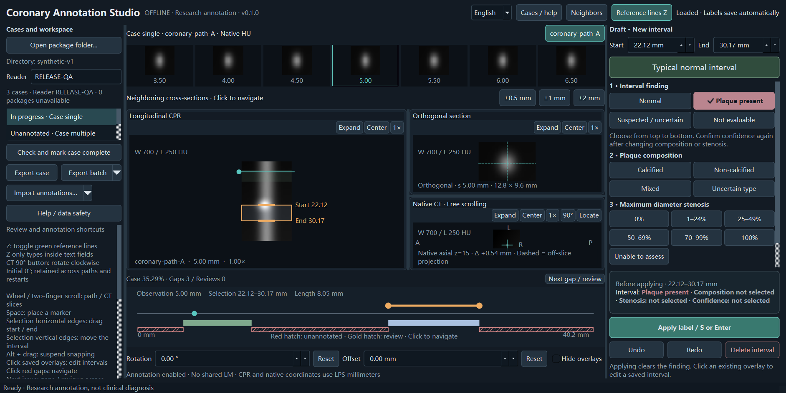

# Coronary Annotation Studio

Offline annotation, review and reliable export of coronary lesions on existing
three-dimensional curved planar reformats (CPRs), with native CT linkage.

**English is the default. Switch to 简体中文 at any time.**



*Actual application window with a mathematical phantom; no patient data.*

[中文文档](docs/zh/index.md) · [Quick start](docs/quickstart.md) ·
[Data format](docs/data-format.md) · [3D Slicer adapter](docs/slicer.md)

## What it does

- Mark, adjust, overwrite and delete coronary lesion intervals.
- Distinguish unannotated regions, explicit negative findings, uncertain findings
  and non-evaluable regions. Missing labels never become negative findings.
- Record plaque composition, stenosis category, confidence, reader and review state.
- Recover drafts and durable undo/redo history after restart.
- Keep each project's database separate; switch between readers within a project.
- Follow supplied spatial mappings into the native CT's LPS millimetre coordinates.
- Export versioned JSON, spreadsheet-safe CSV, audit records and SHA-256 manifests,
  even when source images are offline.

This is research annotation software. It does not extract centerlines, generate
CPRs, make diagnoses or provide clinical validation. Reader completion does not
mean adjudication or training eligibility. The first release does not include
segmentation contours, DICOM/PACS or a multi-reader adjudication workflow.

## Try the synthetic example

From a source checkout, with Python 3.10 or 3.11:

```console
python -m venv .venv
# Activate .venv using your shell, then:
python -m pip install .
python -m annotation_app validate examples/synthetic-v1
python -m annotation_app --package examples/synthetic-v1
```

The bundled example contains only mathematical phantoms, including one path,
multiple paths and an explicitly declared shared left-main segment. It is not
real patient data and does not establish diagnostic accuracy.

For standalone Windows and macOS packages, see [installation](docs/install.md).
Binary availability and tested systems are recorded in the release acceptance
report; a build target is not a claim that every older system was tested.

## Bring your own CPR

Provide a scalar 3D CPR, its original CT (NIfTI or NRRD), and a valid spatial
mapping. Use the [neutral package format](docs/data-format.md) or export an
already generated straightened CPR using [3D Slicer](docs/slicer.md).

```console
python -m annotation_app validate /path/to/package
python -m annotation_app --package /path/to/package
```

No screenshots, MIPs or images without native-coordinate mapping are accepted.
Project scope determines coverage; it does not imply that the entire coronary
tree is represented.

## Contribute

See [CONTRIBUTING.md](CONTRIBUTING.md), [known limitations](docs/limitations.md)
and [CITATION.cff](CITATION.cff). Public tests use synthetic data only:

```console
python -m unittest discover -s tests -v
```

Licensed under [Apache-2.0](LICENSE). Dependencies retain their own licenses;
see [THIRD_PARTY_NOTICES.md](THIRD_PARTY_NOTICES.md) and [NOTICE](NOTICE).
