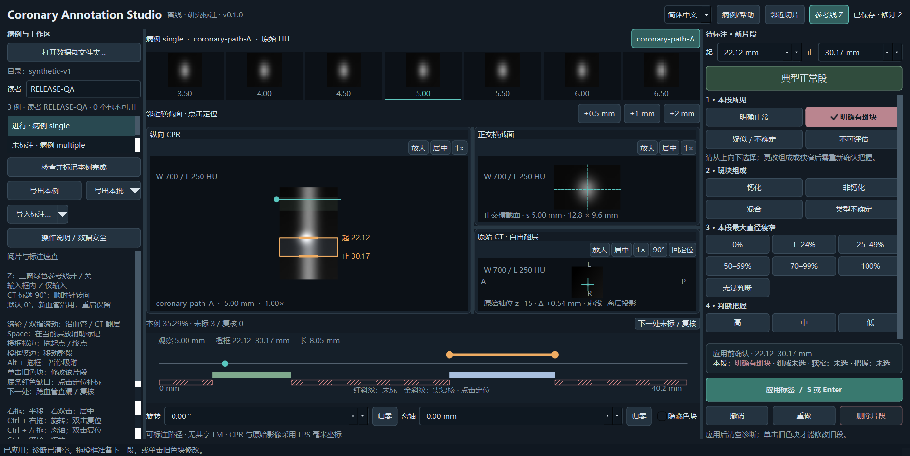

# Coronary Annotation Studio

以上为实际程序截图，影像是数学合成示例，不是真实患者数据。

面向已有三维冠脉 CPR 的离线病变区间标注、复核与可靠导出工具。
界面默认英文，可在运行中切换简体中文并记住选择。

核心流程是：导入带有原始 CT 和空间映射的 CPR → 标注病变区间 → 检查缺口和待复核内容 → 保存、恢复和导出。
本工具不提取中心线、不生成 CPR、不自动诊断，也不进行精细轮廓分割。

- [安装与快速入门](quickstart.md)
- [数据格式与 Slicer 接入](data-format.md)
- [旧版导入与故障排查](troubleshooting.md)
- [实际验收记录](acceptance.md)
- [English documentation](../index.md)

不同项目使用独立数据库。每位读者的记录独立保存。未标注区域不会被当作阴性，完成状态也不等于裁决、临床认可或训练准入。
示例均由数学模型生成，不包含真实患者数据。
